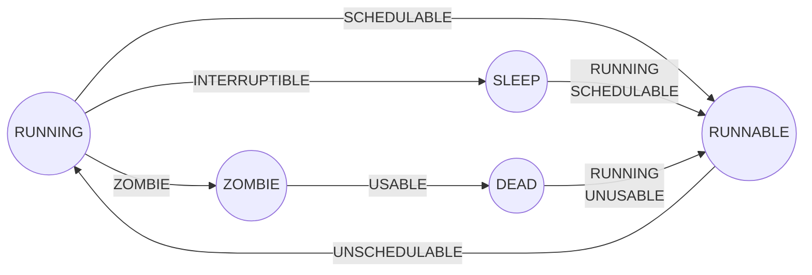
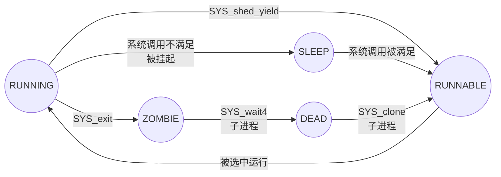

# Unnamed Operating System Project

**PS: 系统不叫Unnamed, 我是真的没想好名字。**


## 注意事项

1. 本文件由MarkDown编辑器软件自动排版, Raw Code会略显混乱, 使用相应软件或网站查看本文档以获得更好的体验。
2. 本文件中可能会使用LaTeX格式的内联公式。使用集成了支持LaTeX格式的内联公式功能的Markdown编辑器或网站查看本文档以获得更好的体验。如果能看到$\LaTeX$而不是`$\LaTeX$`说明所用的工具支持这个功能。
3. 本文件中可能会使用Mermaid渲染图片。使用集成了Mermaid渲染功能的Markdown编辑器或网站查看本文档以获得更好的体验。
4. 本文件编辑时使用的主题是Typora的Github(浅色主题)与Night(深色主题)。如果使用Typora可以选择这两个主题以获得与作者相同的观看体验。


## 项目介绍

1. 本项目试图实现一个运行在RISC-V 64架构下的Unix-like操作系统内核与部分用户态程序。
2. 本项目有两个主要目的: 一个是为了[操作系统比赛](https://os.educg.net)(OS内核实现赛道), 另一个是为了我个人对CPU、操作系统与编译器的一些练习。所以在本项目中可能会看到面对内核赛与我个人目标的一些不同的实现。
3. 本项目对于我个人的练习目的而言: 先实现操作系统, 然后尽量精简操作系统所使用的指令与外部设备, 依据这些指令与外设用FPGA实现一个基于RISC-V ISA的子集SoC系统, 然后实现一个基于这个操作系统的自己写的编译器。
4. 本项目曾用名`xv6-qemu`, 正如其名, 原本是想对[xv6-public](https://github.com/mit-pdos/xv6-public)进行模仿, 但是最终秉承着**改别人代码不如自己重头写**的观点推翻重做。在本项目也学习了[xv6-riscv](https://github.com/mit-pdos/xv6-riscv)(部分函数, 页表函数的部分处理)、[rCore](https://github.com/rcore-os/rCore)(高地址内存的分布)、[RVOS](https://github.com/plctlab/riscv-operating-system-mooc)(UART、CLINT、PLIC的一些寄存器读写)与[内核赛测试用例](https://gitee.com/oscomp/testsuits-for-oskernel/tree/main)(用户态的crt, 部分库)。
5. 除主要目标之外, 还希望本项目能给他人一些参考, 做一些微小的贡献。


## 环境配置

本项目在Ubuntu系统上编译、模拟、调试。

> 我个人是在Parallels Desktop虚拟机上跑的Ubuntu, 平时写代码用的是Xcode。
>
> - PS: 不知道用M1芯片的Mac能不能正常跑虚拟机并运行, 我用的是Intel芯片的。
> - PS: 用macOS的同学不要用macOS本身来编译与模拟, 即使你用brew安了gcc也不要这样做。你可能遇到一些意想不到的问题。(例: macOS和Windows一样不区分大小写)
> - PS: Windows用户强烈不推荐WSL, 另外文件尽量不要用Windows来中转。如果很不幸不能直接在虚拟机中下载, 也请直接导压缩包然后去Linux中去解压。规避一些文件被转换的命运。

用到的工具有:

- gcc-riscv64-unknown-elf
- QEMU
- riscv64-unknown-elf-gdb


### GCC的安装

apt安装即可。


### QEMU的安装

极其不推荐apt的版本。强烈推荐源码下载编译, 可以参考一下[rCore教程](https://rcore-os.github.io/rCore_tutorial_doc/chapter2/part5.html)。但不得不说下载编译很麻烦。

可能遇到的问题如下:

- ERROR: Cannot find Ninja

  解决方法: ```sudo apt install ninja-build```

- ERROR: glib-2.56 gthread-2.0 is required to compile QEMU

  参考[这个博客](https://blog.csdn.net/fuxy3/article/details/104732541)

我个人的安装过程给一个参考:

```shell
wget https://download.qemu.org/qemu-6.1.1.tar.xz
tar xvJf qemu-6.1.1.tar.xz
cd qemu-6.1.1
./configure --target-list=riscv64-softmmu,riscv32-softmmu
cd build
make -j$(nproc)
make install
```

> PS: qemu对RISC-V的模拟本身就存在一些问题, 可以去给他们提issue。


### GDB的安装

首先不推荐使用RVOS所使用的gdb-multiarch, 使用中确实出了不少问题, 不知道现在是否已经修复了。

个人推荐使用riscv64-unknown-elf-gdb。其安装可以参考[rCore教程](https://rcore-os.github.io/rCore-Tutorial-deploy/docs/pre-lab/gdb.html), 但我个人不推荐使用教程里的那个插件。


## 项目结构

主要的代码都在code文件夹下。

backup文件夹或者标有`.back`或者`.backup`都是写废的文件。有一些掉过的坑, 感兴趣可以瞅瞅, 说不定能解决一些问题。

script里是一些脚本, 一些方便开发用的, **一些参与了编译**(例如将一些代码内嵌进内核)。xv6用Perl, 我则用了Python。


# Design


## 进程管理


### 进程状态的设计

| 我们设计的状态 | 对应Unix状态       |     state     |     sched     |  usable  |
| :------------- | :----------------- | :-----------: | :-----------: | :------: |
| RUNNING        | TASK_RUNNING       |    RUNNING    | UNSCHEDULABLE | UNUSABLE |
| RUNNABLE       | TASK_RUNNING       |    RUNNING    |  SCHEDULABLE  | UNUSABLE |
| SLEEP          | TASK_INTERRUPTIBLE | INTERRUPTIBLE | UNSCHEDULABLE | UNUSABLE |
| ZOMBIE         | EXIT_ZOMBIE        |    ZOMBIE     | UNSCHEDULABLE | UNUSABLE |
| DEAD           | EXIT_DEAD          |    ZOMBIE     | UNSCHEDULABLE |  USABLE  |




### 与进程有关的系统调用

| Linux调用号 | 调用名         |
| :---------- | -------------- |
| 93          | SYS_exit       |
| 124         | SYS_shed_yield |
| 172         | SYS_getpid     |
| 173         | SYS_getppid    |
| 220         | SYS_clone      |
| 260         | SYS_wait4      |

PS: execve我们没有被放入这个表中, 毕竟本质只是向当前进程加载程序, 并不涉及进程的转化。


### 进程状态转移图




## 时间管理

**时间的管理暂时只使用时钟中断来实现, 正式实现应该使用RTC外设。**


### 比赛所要求的有关时间的部分

```c
typedef struct
{
    uint64 sec;  // 自 Unix 纪元起的秒数
    uint64 usec; // 微秒数
} TimeVal;

int64 get_time()
{
    TimeVal time;
    int err = sys_get_time(&time, 0);
    if (err == 0)
    {
        return ((time.sec & 0xffff) * 1000 + time.usec / 1000);
    }
    else
    {
        return -1;
    }
}

int sys_get_time(TimeVal *ts, int tz)
{
    return syscall(SYS_gettimeofday, ts, tz);
}

int sleep(unsigned long long time)
{
    TimeVal tv = {.sec = time, .usec = 0};
    if (syscall(SYS_nanosleep, &tv, &tv)) return tv.sec;
    return 0;
}
```


### 我们的设计


#### 在内存中维护三个数据用于维护时间

| 名称    | 解释                         | 行为                                    |
| :------ | :--------------------------- | --------------------------------------- |
| mti_cnt | Mechine Time Interrupt Count | 每当hart0发生时钟中断则加1              |
| nsec    | 纳秒                         | 每当hart0发生时钟中断则进行**某种运算** |
| sec     | 秒                           | 每当nsec累计到对应数值则加1             |

*PS: 实际使用的其实是S态的时钟中断, 只不过命名上如此而已。*


#### 以下四个常量用于计算

| 名称              | 解释                     |
| :---------------- | :----------------------- |
| DEFAULT_INTERVAL  | 默认时钟中断间隔         |
| MECHINE_FREQUENCY | 所使用机器的频率, 单位Hz |
| NMTI_PER_NSEC     | 每纳秒发生MTI的数量      |
| NNSEC_PER_MTI     | 每MTI走过的纳秒数量      |

*NMTI_PER_NSEC: the Number of Mechine Time Interrupt PER NanoSECond.*

*NNSEC_PER_MTI: the Number of NanoSECond PER Mechine Time Interrupt.*


#### NMTI_PER_NSEC与NNSEC_PER_MTI的推导

- $C_{(NMTI\_PER\_NSEC)} = \dfrac{1 \times 10^{-9}}{N_{(DEFAULT\_INTERVAL)} \times \dfrac{1}{f_{(MECHINE\_FEQUENCY)}}} = \dfrac{f}{N\times 10^9}$

- $C_{(NNSEC\_PER\_MTI)} = \dfrac{N_{(DEFAULT\_INTERVAL)} \times \dfrac{1}{f_{(MECHINE\_FEQUENCY)}}}{1 \times 10^{-9}} = \dfrac{N\times 10^9}{f}$

- 考虑到实际内核程序在计算时全部使用整数来计算, 并且应该使算出的一秒的时间>=实际的一秒:

  $C_{(NMTI\_PER\_NSEC)} = int(\dfrac{f}{N\times 10^9}) + 1$


#### nsec计算方法的选择

在我一开始的设计中使用的是`NMTI_PER_NSEC`, 一开始我设计来计算时间的代码如下, 但是这样做有一个问题:

```c
static struct {
    volatile uint64 nsec;
    volatile uint64 sec;
    struct spinlock lock;
} ktime;

static volatile uint64 mti_cnt;

//	这个函数每次hart0遇到MTI就会运行这个函数
void time_tick(void) {
    mti_cnt++;
    if (mti_cnt != 0 && mti_cnt % NMTI_PER_NSEC == 0) {
        mti_cnt -= NMTI_PER_NSEC;
        
        acquire(&ktime.lock);
        ktime.nsec++;
        if (ktime.nsec != 0 && ktime.nsec % POW_TEN_NINE == 0) {
            ktime.nsec -= POW_TEN_NINE;
            ktime.sec++;
        }
        release(&ktime.lock);
    }
}
```

在qemu当中,` MECHINE_FREQUENCY`也就是qemu模拟器的时钟频率是44100Hz(由[这里](https://www.qemu.org/docs/master/system/qemu-manpage.html)可知)。我设置的`DEFAULT_INTERVAL`为0x10000。由此可得`NMTI_PER_NSEC`取近似数的值是1。

实际计算下来这个所谓的"一秒"被放大了1486077097.5056689倍。


- PS:

  由[这里](https://www.qemu.org/docs/master/system/qemu-manpage.html)可知, qemu模拟器的时钟频率是44100Hz。

  **BUG: MECHINE_FREQUENCY太小时会有些离谱**


### 与时间管理有关的系统调用

| Linux调用号 | 调用名           |
| :---------- | ---------------- |
| 101         | SYS_nanosleep    |
| 169         | SYS_gettimeofday |

SYS_times系统调用我们没有放在这一块。

这里应该注意的是:

**这两个系统调用在测试用例中说的结构体是TimeVal, 但是实际上的linux中只有timeval结构体, 而且Linux中这两个系统调使用的是timespec结构体。**


# 文档格式要求

给合作编写文档的同学以参考。


## Mermaid作图

有疑问可以参考[官方手册](https://mermaid-js.github.io/mermaid/#/), 简单的功能可以看[这里](https://zhuanlan.zhihu.com/p/355997933)。

1. 首先声明要用到的node的id, 并声明图形形状。

   1. 如果全图的node的内容都是简单的单词, id请与单词保持一定的相关性
   2. 如果有node的内容是句子, id请以序号的形式出现, 例如`id1`

   ```
   S((SLEEP))
   ```

   

2. 声明关系时, 只使用以下格式。因为这样会使后续修改变得简单。(请注意空格的使用)

   ```
   A --> |text| B
   ```

   
